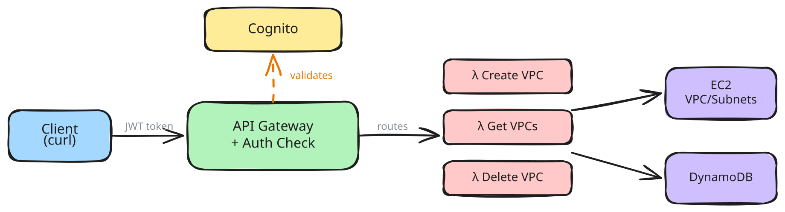

# VPC Management API

AWS serverless API to create, list, and delete VPCs with subnets — fully managed via **Terraform**.

## Architecture

- **API Gateway** (REST) — HTTPS endpoints with Cognito JWT auth
- **Lambda** (Python 3.12) — Business logic per endpoint
- **DynamoDB** — VPC metadata store (pay-per-request)
- **Cognito** — User pool for authentication
- **S3 + DynamoDB** — Terraform remote state (encrypted, locked)

## Prerequisites

- AWS CLI configured (`aws configure`)
- [Terraform](https://developer.hashicorp.com/terraform/install) >= 1.5
- Python 3.12+

## Deploy

### 1. Bootstrap remote state (first time only)

```bash
cd terraform/state-backend
terraform init
terraform apply
```

This creates the S3 bucket and DynamoDB lock table for state management.

### 2. Enable remote backend

Uncomment the `backend "s3"` block in `terraform/providers.tf`, then:

### 3. Deploy the API

```bash
cd terraform
terraform init
terraform plan -var-file=dev.tfvars
terraform apply -var-file=dev.tfvars
```

Note the outputs: **api_url**, **user_pool_id**, **user_pool_client_id**.

## Set Variables

```bash
API_URL=$(terraform -chdir=terraform output -raw api_url)
USER_POOL_ID=$(terraform -chdir=terraform output -raw user_pool_id)
CLIENT_ID=$(terraform -chdir=terraform output -raw user_pool_client_id)
REGION=eu-central-1
```

## Create a Test User

```bash
aws cognito-idp sign-up \
  --client-id $CLIENT_ID \
  --username user@example.com \
  --password YourPass123! \
  --region $REGION

aws cognito-idp admin-confirm-sign-up \
  --user-pool-id $USER_POOL_ID \
  --username user@example.com \
  --region $REGION
```

## Get Auth Token

```bash
TOKEN=$(aws cognito-idp initiate-auth \
  --client-id $CLIENT_ID \
  --auth-flow USER_PASSWORD_AUTH \
  --auth-parameters USERNAME=user@example.com,PASSWORD=YourPass123! \
  --region $REGION \
  --query 'AuthenticationResult.IdToken' \
  --output text)
```

## API Usage

### Create VPC

```bash
curl -X POST $API_URL \
  -H "Authorization: $TOKEN" \
  -H "Content-Type: application/json" \
  -d '{
    "name": "my-vpc",
    "cidr_block": "10.0.0.0/16",
    "subnets": [
      {"name": "private-1a", "cidr_block": "10.0.1.0/24", "az": "eu-central-1a"},
      {"name": "public-1b", "cidr_block": "10.0.2.0/24", "az": "eu-central-1b"}
    ]
  }'
```

### List All VPCs

```bash
curl $API_URL \
  -H "Authorization: $TOKEN"
```

### Get Single VPC

```bash
curl $API_URL/<vpc-id> \
  -H "Authorization: $TOKEN"
```

### Delete VPC

```bash
curl -X DELETE $API_URL/<vpc-id> \
  -H "Authorization: $TOKEN"
```

## Project Structure

```
├── terraform/
│   ├── providers.tf          # AWS provider + backend config
│   ├── variables.tf          # Input variables
│   ├── outputs.tf            # Stack outputs
│   ├── main.tf               # DynamoDB + Cognito
│   ├── iam.tf                # IAM roles + least-privilege policies
│   ├── lambda.tf             # Lambda functions + packaging
│   ├── api_gateway.tf        # REST API + methods + Cognito authorizer
│   ├── dev.tfvars            # Environment-specific values
│   └── state-backend/        # Bootstrap config for remote state
│       └── main.tf
├── src/
│   ├── create/
│   │   └── create_vpc.py     # POST /vpcs
│   ├── get/
│   │   └── get_vpcs.py       # GET /vpcs, GET /vpcs/{vpc_id}
│   └── delete/
│       └── delete_vpc.py     # DELETE /vpcs/{vpc_id}
└── README.md
```

## Design Decisions

- **Terraform over SAM** — industry-standard IaC, supports multi-cloud, modular, with state locking and drift detection.
- **Remote state** — S3 backend with DynamoDB locking for team collaboration and state recovery.
- **Least-privilege IAM** — custom policies scoped to specific DynamoDB table and EC2 VPC actions only.
- **Soft delete** — DELETE marks VPC as `DELETED` in DynamoDB for audit trail.
- **Serverless** — Lambda + API Gateway + DynamoDB = zero idle cost, auto-scaling.
- **Cognito auth** — JWT-based auth on all endpoints. No anonymous access.
- **CIDR validation** — input validated before calling AWS APIs.
- **Environment separation** — `var.environment` in all resource names, use different `.tfvars` per env.

## Cleanup

**1. Delete VPCs** created by the API (real EC2 resources, not managed by Terraform):

```bash
curl -X DELETE $API_URL/<vpc-id> -H "Authorization: $TOKEN"
```

**2. Destroy the stack:**

```bash
cd terraform
terraform destroy -var-file=dev.tfvars
```
# VPC Management API

AWS serverless API to create, list, and delete VPCs with subnets.

## Architecture



## Prerequisites

- AWS CLI configured (`aws configure`)
- AWS SAM CLI installed
- Python 3.12+

## Deploy

```bash
sam build
sam deploy --guided                 # first time (creates samconfig.toml)
sam deploy --no-confirm-changeset   # subsequent deploys
```

After deploy, note the outputs: **ApiUrl**, **UserPoolId**, **UserPoolClientId**.

## Set Variables

Auto-extract from the stack outputs:

```bash
STACK=vpc-api
REGION=us-east-1
export AWS_PAGER=""

API_URL=$(aws cloudformation describe-stacks --stack-name $STACK --region $REGION \
  --query 'Stacks[0].Outputs[?OutputKey==`ApiUrl`].OutputValue' --output text)
USER_POOL_ID=$(aws cloudformation describe-stacks --stack-name $STACK --region $REGION \
  --query 'Stacks[0].Outputs[?OutputKey==`UserPoolId`].OutputValue' --output text)
CLIENT_ID=$(aws cloudformation describe-stacks --stack-name $STACK --region $REGION \
  --query 'Stacks[0].Outputs[?OutputKey==`UserPoolClientId`].OutputValue' --output text)
```

Or set manually:

```bash
API_URL=https://<your-api-id>.execute-api.us-east-1.amazonaws.com/prod
USER_POOL_ID=<your-user-pool-id>
CLIENT_ID=<your-client-id>
```

## Create a Test User

```bash
aws cognito-idp sign-up \
  --client-id $CLIENT_ID \
  --username user@example.com \
  --password YourPass123! \
  --region $REGION

aws cognito-idp admin-confirm-sign-up \
  --user-pool-id $USER_POOL_ID \
  --username user@example.com \
  --region $REGION
```

## Get Auth Token

```bash
TOKEN=$(aws cognito-idp initiate-auth \
  --client-id $CLIENT_ID \
  --auth-flow USER_PASSWORD_AUTH \
  --auth-parameters USERNAME=user@example.com,PASSWORD=YourPass123! \
  --region $REGION \
  --query 'AuthenticationResult.IdToken' \
  --output text)
```

## API Usage

### Create VPC

```bash
curl -X POST $API_URL/vpcs \
  -H "Authorization: $TOKEN" \
  -H "Content-Type: application/json" \
  -d '{
    "name": "my-vpc",
    "cidr_block": "10.0.0.0/16",
    "subnets": [
      {"name": "private-1a", "cidr_block": "10.0.1.0/24", "az": "us-east-1a"},
      {"name": "public-1b", "cidr_block": "10.0.2.0/24", "az": "us-east-1b"}
    ]
  }'
```

### List All VPCs

```bash
curl $API_URL/vpcs \
  -H "Authorization: $TOKEN"
```

### Get Single VPC

```bash
curl $API_URL/vpcs/<vpc-id> \
  -H "Authorization: $TOKEN"
```

### Delete VPC

```bash
curl -X DELETE $API_URL/vpcs/<vpc-id> \
  -H "Authorization: $TOKEN"
```

## Project Structure

```
├── template.yaml         # SAM template (infra)
├── samconfig.toml        # Deploy config
├── src/
│   ├── create/
│   │   └── create_vpc.py # POST /vpcs
│   ├── get/
│   │   └── get_vpcs.py   # GET /vpcs, GET /vpcs/{vpc_id}
│   └── delete/
│       └── delete_vpc.py # DELETE /vpcs/{vpc_id}
└── README.md
```

## Design Decisions

- **Soft delete** — DELETE marks VPC as `DELETED` in DynamoDB instead of removing the record. Allows audit trail.
- **Serverless** — Lambda + API Gateway + DynamoDB = zero idle cost, auto-scaling.
- **Cognito auth** — JWT-based auth on all endpoints. No anonymous access.
- **Separate Lambda per endpoint** — each function has only the IAM policies it needs (least privilege).

## Cleanup

**1. Delete VPCs created by the API** (these are real EC2 resources, not part of the stack):

```bash
# List your VPCs first, then delete each one via the API
curl -X DELETE $API_URL/vpcs/<vpc-id> -H "Authorization: $TOKEN"
```

**2. Delete the stack** (Lambdas, API Gateway, DynamoDB, Cognito):

```bash
sam delete --stack-name $STACK --region $REGION --no-prompts
```

**3. Delete the SAM-managed S3 bucket** (shared across SAM projects — only if no longer needed):

```bash
BUCKET=$(aws s3 ls | grep aws-sam-cli-managed-default | awk '{print $3}')

# delete all object versions and delete markers
aws s3api list-object-versions --bucket $BUCKET --query '{Objects: Versions[].{Key:Key,VersionId:VersionId}}' --output json \
  | aws s3api delete-objects --bucket $BUCKET --delete file:///dev/stdin > /dev/null 2>&1
aws s3api list-object-versions --bucket $BUCKET --query '{Objects: DeleteMarkers[].{Key:Key,VersionId:VersionId}}' --output json \
  | aws s3api delete-objects --bucket $BUCKET --delete file:///dev/stdin > /dev/null 2>&1

aws s3 rb s3://$BUCKET
aws cloudformation delete-stack --stack-name aws-sam-cli-managed-default --region $REGION
```
