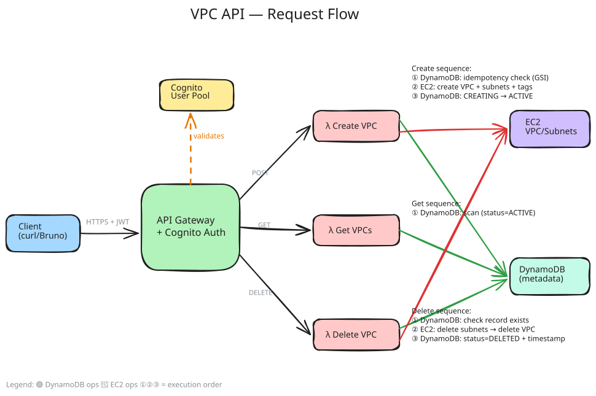

# VPC Management API

AWS serverless API to create, list, and delete VPCs with subnets — fully managed via **Terraform**.

## Architecture



- **API Gateway** (REST) — HTTPS endpoints with Cognito JWT auth
- **Lambda** (Python 3.12) — Business logic per endpoint
- **DynamoDB** — VPC metadata store (pay-per-request)
- **Cognito** — User pool for authentication
- **S3** — Terraform remote state (encrypted, versioned, locked)

## Prerequisites

- AWS CLI configured (`aws configure`)
- [Terraform](https://developer.hashicorp.com/terraform/install) >= 1.5
- Python 3.12+

## Deploy

### 1. Bootstrap remote state (first time only)

```bash
cd terraform/state-backend
terraform init
terraform apply
```

This creates the S3 bucket for Terraform state (encrypted, versioned, private).

### 2. Deploy the API

```bash
cd terraform
terraform init
terraform plan -var-file=dev.tfvars
terraform apply -var-file=dev.tfvars
```

Note the outputs: **api_url**, **user_pool_id**, **user_pool_client_id**.

## Set Variables

From the `terraform/` directory:

```bash
REGION=eu-central-1
API_URL=$(terraform output -raw api_url)
USER_POOL_ID=$(terraform output -raw user_pool_id)
CLIENT_ID=$(terraform output -raw user_pool_client_id)
```

## Create a Test User

```bash
aws cognito-idp admin-create-user \
  --region $REGION \
  --user-pool-id $USER_POOL_ID \
  --username testuser@example.com \
  --temporary-password 'TempPass1!' \
  --message-action SUPPRESS

aws cognito-idp admin-set-user-password \
  --region $REGION \
  --user-pool-id $USER_POOL_ID \
  --username testuser@example.com \
  --password 'TestPass123!' \
  --permanent
```

## Get Auth Token

```bash
TOKEN=$(aws cognito-idp initiate-auth \
  --region $REGION \
  --client-id $CLIENT_ID \
  --auth-flow USER_PASSWORD_AUTH \
  --auth-parameters USERNAME=testuser@example.com,PASSWORD='TestPass123!' \
  --query 'AuthenticationResult.IdToken' \
  --output text)
```

## API Usage

### Create VPC

```bash
curl -s -X POST $API_URL \
  -H "Authorization: $TOKEN" \
  -H "Content-Type: application/json" \
  -d '{
    "name": "my-vpc",
    "cidr_block": "10.0.0.0/16",
    "idempotency_key": "unique-request-123",
    "subnets": [
      {"name": "private-1a", "cidr_block": "10.0.1.0/24", "az": "eu-central-1a"},
      {"name": "public-1b", "cidr_block": "10.0.2.0/24", "az": "eu-central-1b"}
    ]
  }' | jq
```

### List All VPCs

```bash
curl -s $API_URL \
  -H "Authorization: $TOKEN" | jq
```

### Get Single VPC

```bash
curl -s $API_URL/<vpc-id> \
  -H "Authorization: $TOKEN" | jq
```

### Delete VPC

```bash
curl -s -X DELETE $API_URL/<vpc-id> \
  -H "Authorization: $TOKEN" | jq
```

## Bruno Collection

The `bruno/` folder contains a [Bruno](https://www.usebruno.com/) API collection for testing endpoints interactively.

### Setup

1. Install Bruno — either the [desktop app](https://www.usebruno.com/) or the VS Code extension
2. Open the `bruno/` folder as a collection
3. Select the **dev** environment
4. Update the environment variables in `bruno/environments/dev.bru`:
   ```
   base_url → terraform output -raw api_url   (from terraform/ directory)
   token    → the ID token from "Get Auth Token" step
   vpc_id   → set after creating a VPC
   ```

### Requests

| Request | Method | Endpoint |
|---------|--------|----------|
| Create VPC | POST | `/vpcs` |
| Create VPC (Idempotent) | POST | `/vpcs` (with `idempotency_key`) |
| List VPCs | GET | `/vpcs` |
| Get VPC | GET | `/vpcs/{vpc_id}` |
| Delete VPC | DELETE | `/vpcs/{vpc_id}` |

## Project Structure

```
├── terraform/
│   ├── providers.tf          # AWS provider + backend config
│   ├── variables.tf          # Input variables
│   ├── outputs.tf            # Stack outputs
│   ├── main.tf               # DynamoDB + Cognito
│   ├── iam.tf                # IAM roles + least-privilege policies
│   ├── lambda.tf             # Lambda functions + packaging
│   ├── api_gateway.tf        # REST API + methods + Cognito authorizer
│   ├── dev.tfvars            # Environment-specific values
│   └── state-backend/        # Bootstrap config for remote state
│       └── main.tf
├── src/                        # Lambda function handlers (Python 3.12)
│   ├── create/
│   │   └── create_vpc.py     # POST /vpcs
│   ├── get/
│   │   └── get_vpcs.py       # GET /vpcs, GET /vpcs/{vpc_id}
│   └── delete/
│       └── delete_vpc.py     # DELETE /vpcs/{vpc_id}
├── bruno/                    # Bruno API collection
│   ├── bruno.json
│   ├── collection.bru
│   ├── environments/
│   │   └── dev.bru
│   ├── Create VPC.bru
│   ├── Create VPC (Idempotent).bru
│   ├── List VPCs.bru
│   ├── Get VPC.bru
│   └── Delete VPC.bru
├── tests/                    # Unit tests (moto-mocked AWS)
│   ├── conftest.py
│   ├── requirements-dev.txt
│   ├── test_create_vpc.py
│   ├── test_get_vpcs.py
│   └── test_delete_vpc.py
└── README.md
```

## Tests

Unit tests use [moto](https://github.com/getmoto/moto) to mock AWS services locally.

```bash
python3 -m venv .venv && source .venv/bin/activate
pip install -r tests/requirements-dev.txt
python -m pytest tests/ -v
```

## Design Decisions

- **Terraform** — industry-standard IaC, supports multi-cloud, modular, with state locking and drift detection.
- **Remote state** — S3 backend with native locking (`use_lockfile`) for team collaboration and state recovery.
- **Least-privilege IAM** — custom policies scoped to specific DynamoDB table and EC2 VPC actions only.
- **Soft delete** — DELETE marks VPC as `DELETED` in DynamoDB for audit trail.
- **Serverless** — Lambda + API Gateway + DynamoDB = zero idle cost, auto-scaling.
- **Cognito auth** — JWT-based auth on all endpoints. No anonymous access.
- **CIDR validation** — input validated before calling AWS APIs.
- **Environment separation** — `var.environment` in all resource names, use different `.tfvars` per env.

## Cleanup

**1. Delete VPCs** created by the API (real EC2 resources, not managed by Terraform):

```bash
curl -X DELETE $API_URL/<vpc-id> -H "Authorization: $TOKEN"
```

**2. Destroy the stack:**

```bash
cd terraform
terraform destroy -var-file=dev.tfvars
```
